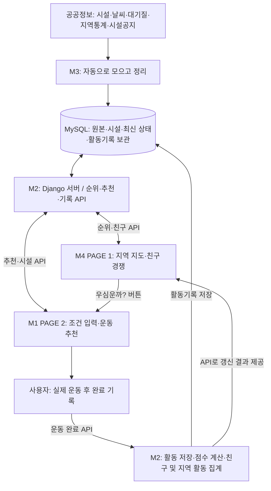

# 우심운까 — 우리 심심한데 운동이나 할까?

> 지역과 친구의 운동 경쟁으로 동기를 만들고, 지금 가능한 운동과 장소를 추천하는 생활체육 웹서비스입니다.

**이 문서는 M1~M4가 무엇을 만들고, 누구에게 무엇을 전달해야 하는지 정리한 팀 개발 안내서입니다.**

현재 문서는 목표 설계와 작업 계획입니다. 체크되지 않은 항목은 구현 완료를 의미하지 않습니다. 기존 지도 데모는 예시 데이터를 사용하는 시연용 화면이며, 아래의 전체 서비스와 구분합니다.

- GitHub 조직: [2th-MLOps-engineer](https://github.com/2th-MLOps-engineer)
- 확인된 기존 저장소: [WooSimWoonKka](https://github.com/2th-MLOps-engineer/WooSimWoonKka)
- 팀 공유 저장소: [team-share](https://github.com/2th-MLOps-engineer/team-share)
- 담당자 실명과 GitHub 계정: 팀에서 M1~M4에 연결해 확정합니다.

## 1. 우리가 만드는 서비스

| 단계 | 사용자가 하는 일 | 서비스가 보여주는 것 |
| --- | --- | --- |
| 1. 경쟁 확인 | 지역 지도와 친구 순위를 본다 | 내 지역 순위, 순위 변화, 친구 점수, 지역 운동열기 |
| 2. 운동 결정 | ‘우심운까?’ 버튼을 누른다 | 운동 추천 화면 |
| 3. 조건 입력 | 위치·가능한 시간·운동 종목·이동 조건을 입력한다 | 현재 조건에 맞는 운동과 시설 |
| 4. 실제 운동 | 시설을 선택하고 운동한다 | 장소·운영정보·추천 이유 |
| 5. 완료 기록 | 운동 완료를 누른다 | 활동점수, 갱신된 친구 순위와 지역 운동열기 |

**핵심은 ‘경쟁 → 운동 추천 → 실제 운동 → 점수 → 다시 경쟁’의 연결입니다.**

## 2. 전체 구조를 쉽게 이해하기

- **프론트엔드**: 사용자가 보는 웹 화면입니다. M4가 첫 화면을 만들고, M1이 추천 화면과 전체 사이트를 완성합니다.
- **백엔드**: 요청을 받아 데이터를 조회하고 순위·추천·점수를 계산하는 서버입니다. M2가 담당합니다.
- **API**: 화면과 서버가 약속된 형식으로 정보를 주고받는 창구입니다.
- **데이터 파이프라인**: 외부 정보를 정해진 주기로 수집하고 정리하는 작업입니다. M3가 담당합니다.
- **데이터베이스**: 수집한 정보와 사용자 기록을 저장하는 공용 보관함입니다.

화면은 Django API를 통해 정보를 받습니다. 프론트엔드에서 MySQL이나 외부 공공데이터 API에 직접 접근하지 않습니다.

## 3. 담당별 역할 한눈에 보기

| 담당 | 한 문장으로 설명 | 주요 작업 | 전달할 결과물 | 완료 기준 |
| --- | --- | --- | --- | --- |
| **M1** | 추천 화면을 만들고 모든 화면을 하나로 연결한다 | PAGE 2, 공통 UI, 페이지 이동, API 연결, 최종 프론트엔드 통합 | 최종 웹 화면, 실행 안내, 통합 확인 결과 | PAGE 1 → PAGE 2 → 운동 완료 → 갱신된 순위까지 연결 |
| **M2** | 화면 뒤에서 추천·순위·점수를 계산한다 | Django, DB 모델·마이그레이션, 서비스 API, 규칙 기반 추천, 활동점수 처리 | API 명세, DB 스키마, 동작하는 서버 | 화면이 필요한 데이터를 API로 받고 운동 기록이 중복 없이 반영 |
| **M3** | 필요한 공공정보를 모아 믿고 쓸 수 있게 정리한다 | 수집기, 정제, 중복 제거, 정기 실행, 재시도·로그 | 수집 코드, 데이터 명세, 적재 데이터, 실행·오류 기록 | 같은 수집을 반복해도 중복이 쌓이지 않고 일부 실패가 전체를 중단하지 않음 |
| **M4** | 첫 화면에서 운동하고 싶은 마음이 들게 만든다 | PAGE 1 지도, 지역 상세, 친구 순위, 경쟁 메시지, 추천 화면 이동 버튼 | PAGE 1 화면·컴포넌트, 샘플 데이터, 인수 안내 | 지도 이동·확대·지역 선택과 순위 표시가 동작하고 M1이 통합 가능 |

**최종 프론트엔드 책임자는 M1입니다. M4는 PAGE 1의 개발 담당자이며, 순위 계산은 M2가 담당합니다.**

## 4. M1 — 운동 추천 화면 + 최종 프론트엔드 통합

### 해야 할 일

- [ ] 프론트엔드 기술, 실행 방법, 공통 스타일, 페이지 경로를 M4와 먼저 합의한다.
- [ ] PAGE 2에 현재 위치, 가능한 시간, 선호 운동, 최대 이동시간, 이동수단 입력을 만든다.
- [ ] 위치 권한이 거부되어도 직접 지역·위치를 선택할 수 있는 대안을 마련한다.
- [ ] Recommendation API로 조건을 보내고 추천 결과를 표시한다.
- [ ] 추천 시설, 점수, 추천 이유, 이동시간, 예상 운동시간을 보여준다.
- [ ] 날씨·대기질·운영 상태·안전·확인 필요 정보를 표시한다.
- [ ] 시설 상세와 지도 보기 기능을 연결한다.
- [ ] 불러오는 중, 오류, 추천 결과 없음, 정보 부족 상태를 처리한다.
- [ ] 운동 완료 요청과 완료 결과 화면을 연결한다.
- [ ] M4의 PAGE 1을 인수하고 공통 UI·페이지 이동·API 호출 방식을 통일한다.
- [ ] 모바일·데스크톱에서 전체 사용자 흐름을 확인한다.

### 받아야 할 것 / 전달할 것

| 상대 | 받아야 할 것 | 전달할 것 |
| --- | --- | --- |
| M2 | 추천·시설·사용자·운동 완료 API, 예시 응답, 오류 형식 | 필요한 입력·출력 필드, 화면 연동 중 발견한 문제 |
| M4 | PAGE 1 코드, 실행법, 샘플 데이터, 사용 컴포넌트와 경로 | 공통 UI 규칙, 페이지 경로, API 연결 방식, 인수 확인 결과 |

**완료 기준:** 사용자가 첫 화면에서 추천 화면으로 이동하고, 추천 시설을 확인한 후 운동을 완료하면 갱신된 친구·지역 활동 정보를 볼 수 있습니다.

## 5. M2 — Django 백엔드 / API / 추천·순위 계산

### 해야 할 일

- [ ] Django 프로젝트와 개발용 설정, 환경변수 예시를 준비한다.
- [ ] M3와 테이블·시설 ID·행정구역 코드·시각 및 단위 기준을 합의한다.
- [ ] DB 모델과 스키마 변경 파일인 마이그레이션을 관리한다.
- [ ] 사용자 식별·로그인 방식과 친구 관계 등록 방식을 확정하고 구현한다.
- [ ] 지역 순위 목록·상세와 친구 순위 API를 만든다.
- [ ] 시설·프로그램·운영정보 조회 API를 만든다.
- [ ] 공공통계 기반 지역 비교의 기준연도·산식·동률 처리를 정의한다.
- [ ] 규칙 기반 추천 엔진을 구현한다.
- [ ] 운동 완료 기록, 활동점수, 친구 순위, 지역 운동열기 집계를 구현한다.
- [ ] 동일 운동 완료 요청의 재전송으로 점수가 중복 적립되지 않게 처리한다.
- [ ] 잘못된 입력, 권한 없는 요청, 정보 부족, 서버 오류의 응답을 통일한다.
- [ ] API 명세와 정상·오류 예시 응답을 제공한다.

### 추천 엔진은 무엇을 하나요?

AI 모델 학습을 전제로 하지 않습니다. 정해진 기준으로 판단하고 이유를 설명하는 **Execution Score Engine**을 만듭니다.

| 구분 | 내용 |
| --- | --- |
| 사용자 입력 | 현재 위치, 가능한 시간, 선호 운동, 최대 이동시간, 이동수단 |
| 함께 보는 정보 | 시설, 프로그램, 교통, 날씨, 대기질, 시설 안전, 운영공지 |
| 판단 기준 | 접근성, 시간 적합성, 날씨·대기질, 안전, 운동 종목 적합성 |
| 결과 | 추천점수, 추천 이유, 상위 N개 시설, 확인 필요 정보 |

| 상태 | 사용자에게 보여줄 의미 |
| --- | --- |
| `AVAILABLE` | 현재 확인한 조건에서 이용 가능 |
| `CHECK_REQUIRED` | 운영·환경 등 추가 확인 필요 |
| `UNAVAILABLE` | 현재 조건으로 이용 불가 |
| `UNKNOWN` | 판단할 정보가 부족함 |

휴관이나 명확한 이용불가 조건은 점수가 높아도 추천에서 제외하거나 이용불가로 표시합니다. 안전·운영 정보가 없거나 오래되었다고 ‘안전함’ 또는 ‘이용 가능’으로 단정하지 않습니다. 점수 가중치와 정보의 유효기간은 팀 합의 후 문서화합니다.

**완료 기준:** 같은 조건에서 일관된 추천 결과와 이유를 제공하고, 운동 완료 요청 한 건이 활동기록·점수·친구 및 지역 활동 집계에 일관되게 반영됩니다.

## 6. M3 — 공공데이터 수집 / 정리 / 자동 갱신

### 수집 대상

아래는 연동 후보입니다. 실제 제공 항목·이용 조건·갱신 주기·API 신청 가능 여부는 각 출처에서 확인한 뒤 확정합니다.

| 출처 | 필요한 정보 | 사용 목적 |
| --- | --- | --- |
| 국민체육진흥공단 / 체육종합빅데이터센터 | 공공체육시설, 시설 현황, 프로그램, 개방학교, 인접 교통, 안전점검 | 운동 장소·접근성·이용 조건 판단 |
| 기상청 | 날씨, 기온, 강수, 풍속, 시간별 예보 | 실외 운동 적합성 판단 |
| 에어코리아 | PM10, PM2.5, 대기질 | 공기 상태를 고려한 추천 |
| 지역 운동·건강 공공데이터 | 걷기·운동 실천·생활체육 지표 | 공공통계 기반 지역 비교 |
| 체육시설 홈페이지 | 휴관, 공사, 점검, 임시 이용제한, 운영시간 변경, 프로그램 공지 | 실제 운영 상태 보완 |

### 해야 할 일

- [ ] 출처별 제공 방식, 이용 조건, 호출 제한, 갱신 주기를 조사한다.
- [ ] Python·Requests로 API 수집기를 만든다.
- [ ] 홈페이지 수집이 허용되는 범위에서 BeautifulSoup·Selenium을 사용한다.
- [ ] 원본을 RAW 영역에 보관하고 수집 시각·출처를 남긴다.
- [ ] 필수값·좌표·날짜·단위·이상값을 검사한다.
- [ ] 시설 ID와 행정구역 코드를 통일하고 중복을 제거한다.
- [ ] 정리된 기본정보와 최신 상태를 MySQL에 적재한다.
- [ ] APScheduler로 출처별 자동 갱신을 설정한다.
- [ ] 수집기별 실패를 분리하고 제한된 재시도·오류 기록을 남긴다.
- [ ] 데이터가 언제 기준인지, 언제 수집했는지, 언제까지 유효한지 구분한다.
- [ ] 수집 방법·필드·누락 처리·정기 실행 방법을 문서화한다.

**처리 순서:** 가져오기 → 값 검사 → 형태 변환 → 표준 통일 → 중복 제거 → 일괄 저장 → 작업 기록.

| 저장 영역 | 쉬운 설명 | 대표 테이블 |
| --- | --- | --- |
| RAW | 외부에서 받은 원본 | `raw_kspo_facility`, `raw_weather`, `raw_crawl_notice` |
| MASTER | 정리된 시설·프로그램 기본정보 | `facility`, `program`, `transport` |
| SNAPSHOT | 특정 시점의 최신 환경·시설 상태 | `weather_snapshot`, `air_quality_snapshot`, `facility_status_snapshot` |
| SERVICE | 사용자와 서비스의 활동·순위·실행 기록 | `user`, `friendship`, `activity_log`, `region_statistics`, `region_ranking`, `recommendation_log`, `pipeline_log` |

M3는 외부 데이터 적재와 수집 로그를 담당하고, M2는 사용자 활동·서비스 계산과 DB 마이그레이션을 담당합니다. 테이블 계약은 두 담당자가 함께 합의합니다.

**완료 기준:** 수집을 반복해도 불필요한 중복이 쌓이지 않으며, 한 출처가 실패해도 다른 출처는 갱신됩니다. M2가 출처·기준시점·정제된 필드를 확인할 수 있어야 합니다.

## 7. M4 — PAGE 1 / 경쟁 지도·랭킹 화면

### 해야 할 일

- [ ] M1과 프론트엔드 기술·공통 컴포넌트·페이지 경로를 합의한다.
- [ ] 대한민국 지도 중심의 첫 화면을 만든다.
- [ ] 지도 확대·축소·드래그 이동과 모바일 터치를 지원한다.
- [ ] 아래가 뾰족한 물방울 핀에 지역명과 순위를 표시한다.
- [ ] HOT·RISING·TOP 표시와 내 지역 강조를 만든다.
- [ ] 지역 선택 시 전국·지역 순위, 이전 순위, 변화, 세부 지표를 보여준다.
- [ ] 친구 순위와 나와의 점수 차이를 보여준다.
- [ ] ‘민수까지 640점’과 같은 경쟁 메시지를 응답 데이터로 표시한다.
- [ ] ‘우심운까?’ 버튼을 PAGE 2로 연결한다.
- [ ] 예시 데이터 표시, 로딩·빈 결과·오류 상태를 만든다.
- [ ] M2가 제공하는 순위·친구 API 형식에 맞춰 화면을 연결한다.
- [ ] M1에게 PAGE 1 코드·실행법·필요 환경변수·샘플 응답·남은 작업을 전달한다.

**주의:** M4가 브라우저에서 공식 순위나 활동점수를 독자적으로 계산하지 않습니다. HOT·급상승 기준도 M2와 합의한 값 또는 상태를 사용합니다.

**완료 기준:** 핀만 보고 지역·순위·급상승 여부를 이해할 수 있고, 지역 상세·친구 순위·추천 화면 이동이 동작합니다. M1이 별도 재작성 없이 인수할 수 있어야 합니다.

## 8. 반드시 분리할 두 가지 순위

| 구분 | 공공통계 기반 지역 순위 | 우심운까 활동 순위·운동열기 |
| --- | --- | --- |
| 자료 | 외부의 지역 운동·건강통계 | 사용자가 남긴 운동 완료 기록 |
| 의미 | 같은 기준으로 비교한 지역 지표 | 서비스 참여자의 친구 점수·지역별 운동 활동 |
| 갱신 | 공공통계가 갱신될 때 | 서비스의 활동 집계 주기에 따라 |
| 화면 표시 | 출처, 기준연도, 산식, 순위 변화 | 집계 기간, 활동점수, 지역 운동열기 |
| 운동 완료의 영향 | 직접 바뀌지 않음 | 활동점수와 집계에 반영 |

공공데이터로 팀이 산출한 순위는 기관이 발표한 ‘공식 순위’와 구분해 표기합니다. `region_ranking`을 함께 쓴다면 순위 종류·기간을 명시하거나 저장 구조를 분리합니다. 서로 다른 통계연도나 산식을 비교해 상승 폭을 만들지 않습니다.

## 9. API 역할 분담 — M2 제공, M1·M4 사용

아래 경로는 초기 설계안입니다. 요청·응답 필드와 인증 방식은 첫 개발 단계에서 확정합니다.

| API | 하는 일 | 주요 사용 담당 |
| --- | --- | --- |
| `GET /api/rankings` | 지도에 표시할 지역 순위 목록 | M4 → 최종 통합 M1 |
| `GET /api/rankings/{region}` | 선택한 지역 상세·지표·변화 | M4 → 최종 통합 M1 |
| `GET /api/friends/ranking` | 친구 점수와 순위 | M4 → 최종 통합 M1 |
| `GET /api/users/me` | 로그인한 사용자·지역 정보 | M1·M4 |
| `POST /api/recommendations` | 위치·시간·종목 조건에 맞는 추천 | M1 |
| `GET /api/facilities/{id}` | 시설 상세·운영·확인 필요 정보 | M1 |
| `POST /api/activities/complete` | 운동 완료 기록과 활동점수 반영 | M1 |

친구 등록·로그인 관련 API와 지역 운동열기 조회 방식은 별도 확정합니다. 공공통계와 서비스 활동은 응답에서도 종류와 집계 기간을 구분합니다.

### 먼저 맞출 데이터 약속

- 공통 식별자: `region_code`, `facility_id`, `user_id`.
- 시간·단위: 데이터 기준시각, 수집시각, 타임존, 이동·운동시간 단위.
- 순위: 종류, 기준연도 또는 집계 기간, 동률 처리, 이전 순위가 없을 때의 표시.
- 추천: 요청 필드, 4가지 결과 상태, 점수·이유, 정보 부족·유효기간 처리.
- 활동: 기록 대상, 점수 산식, 중복 요청 식별 방법, 갱신 시점.
- 오류: 입력 오류, 인증·권한 오류, 데이터 없음, 외부정보 지연을 구분하는 공통 형식.

## 10. 개발 순서 — 먼저 연결하고, 범위를 넓힙니다

| 단계 | M1 | M2 | M3 | M4 | 함께 확인할 결과 |
| --- | --- | --- | --- | --- | --- |
| 0. 약속 정하기 | 화면 기술·경로·공통 UI | API·DB·인증 초안 | 출처·필드·ID·갱신 기준 | 지도 표시 항목·필요 응답 | 같은 용어와 예시 응답으로 개발 시작 |
| 1. 예시로 연결 | PAGE 2 입력·결과, 화면 이동 | 샘플 응답을 주는 API | 시설 한 출처 수집·샘플 적재 | PAGE 1 지도·상세·친구 화면 | 예시 데이터로 PAGE 1 → PAGE 2 이동 |
| 2. 실제 데이터 연결 | 추천·시설 API 연동 | DB 조회·추천·지역 순위 | 시설·날씨·대기질·통계 갱신 | 순위·친구 API 연동 | 실제 데이터와 예시 데이터 구분 |
| 3. 운동 순환 완성 | 운동 완료·갱신 화면 | 기록·중복 방지·점수·활동 집계 | 실패 복구·최신성·로그 | 갱신된 경쟁 정보 표시 | 운동 완료 → 친구·지역 활동 갱신 |
| 4. 최종 통합 | PAGE 1 인수·전체 화면 확인 | API 오류·권한·집계 점검 | 재수집·일부 실패 점검 | 인수 지원·지도 오류 수정 | 전체 시연 흐름과 실행 안내 완성 |

**서로 기다리지 않는 방법:** M2가 예시 응답을 먼저 공유하면 M1·M4는 화면을 만들 수 있습니다. M2·M3가 DB 계약을 먼저 맞추면 수집과 서버 개발도 병행할 수 있습니다.

## 11. 작업 공간 제안

`team-share`는 역할과 협업 기준을 공유하는 저장소로 사용합니다. 아래는 실제 개발 저장소에 적용할 구조 제안이며, 현재 폴더나 실행 가능한 코드가 모두 존재한다는 뜻은 아닙니다. 코드 저장 위치는 팀에서 확정합니다.

| 경로 | 용도 | 주 담당 |
| --- | --- | --- |
| `frontend/` | 최종 웹 화면 | M1 |
| `frontend/src/pages/competition/` | PAGE 1 지도·경쟁 화면 | M4 개발 → M1 인수 |
| `frontend/src/pages/recommendation/` | PAGE 2 운동 추천 화면 | M1 |
| `frontend/src/components/` | 공통 버튼·카드·상태 표시 | M1 기준으로 M4 협업 |
| `backend/` | Django·API·DB 모델·마이그레이션 | M2 |
| `data_pipeline/` | 수집기·정제·자동 갱신·로그 | M3 |
| `docs/api.md` | 요청·응답·오류 예시 | M2 |
| `docs/data-contract.md` | 테이블·공통 ID·단위·갱신 기준 | M2·M3 |
| `docs/frontend-handoff.md` | PAGE 1 실행·연결·인수 안내 | M4 작성, M1 확인 |
| `docs/decisions.md` | 팀이 합의한 산식·기술·정책 | 전원 |

프론트엔드 프레임워크를 확정한 뒤 실제 경로를 조정합니다. 실제 구현 전에는 동작하지 않는 설치·실행 명령을 README에 기재하지 않습니다.

## 12. 협업 규칙 제안

1. 작업 전에 GitHub Issue로 목적·담당·완료 기준을 정합니다. Issue는 ‘할 일 카드’입니다.
2. `main`에서 작업 브랜치를 만듭니다. 예: `feat/m4-competition-map`, `feat/m2-recommendation-api`, `feat/m3-weather-collector`, `feat/m1-recommendation-page`.
3. 작은 기능 단위로 변경을 올리고 Pull Request(PR)를 만듭니다. PR은 ‘변경 검토 요청’입니다.
4. PR에는 무엇을 바꿨는지, 왜 필요한지, 확인 방법과 결과, 남은 문제를 적습니다.
5. API·DB·공통 UI 변경은 사용하는 담당자가 확인한 뒤 합칩니다. 프론트엔드 통합 변경은 M1이 확인합니다.
6. `main`은 팀이 시연할 수 있는 상태로 유지하는 것을 목표로 합니다. 코드 리뷰와 통합 확인 후 반영합니다.
7. 비밀키·DB 비밀번호·실제 사용자의 위치 및 개인 활동 원본은 저장소에 올리지 않습니다. 환경변수 이름과 가짜 예시만 `.env.example`로 공유합니다.
8. 산식·경로·응답 형식이 바뀌면 관련 문서를 같은 PR에서 수정합니다.

이 규칙은 팀 운영 제안이며, GitHub 브랜치 보호나 필수 리뷰 설정이 자동으로 적용된 상태는 아닙니다.

### 바로 시작할 첫 작업

| 담당 | 첫 Issue 제목 | 결과물 |
| --- | --- | --- |
| M1 | `[M1] 화면 기술·공통 UI·PAGE 2 기본 흐름 확정` | 기술 선택, 화면 경로, 입력·결과 화면, M4와의 공통 규칙 |
| M2 | `[M2] DB·API 계약 및 샘플 응답 작성` | DB 초안, API 문서, 순위·추천·운동 완료 예시 |
| M3 | `[M3] 공공데이터 목록과 시설 수집기 1개 완성` | 출처·이용 조건·필드 표, 재실행 가능한 시설 수집 코드 |
| M4 | `[M4] 예시 데이터 기반 경쟁 지도 구현` | 이동·확대·지역 선택·핀 순위·상세·PAGE 2 이동 |

위 목록은 Issue 작성용 초안입니다. 실제 Issue 생성과 담당 계정 지정은 별도 작업입니다.

## 13. 팀 전체 완료 체크리스트

- [ ] 처음 방문한 사람이 서비스 목적과 화면 이동을 이해한다.
- [ ] 지도에서 지역과 순위를 확인하고 상세 내용을 볼 수 있다.
- [ ] 친구 순위와 내 점수 차이를 확인할 수 있다.
- [ ] 조건에 맞는 운동·시설 추천과 추천 이유를 확인할 수 있다.
- [ ] 휴관·이용불가·정보 부족을 이용 가능으로 잘못 표시하지 않는다.
- [ ] 운동 완료가 기록되고 친구 순위·지역 운동열기에 반영된다.
- [ ] 완료 요청을 반복해도 동일 활동의 점수가 중복 적립되지 않는다.
- [ ] 사용자 활동이 공공통계 기반 순위를 바꾸지 않는다.
- [ ] 화면에 데이터 출처·기준연도·집계 기간·예시 여부가 구분된다.
- [ ] 외부 수집 일부 실패 시 전체 서비스가 멈추지 않고 정보의 상태를 알 수 있다.
- [ ] 위치 권한 거부, API 오류, 결과 없음과 모바일 화면을 확인한다.
- [ ] M4 → M1 인수가 끝나고 전원이 실행·시연 방법을 따라 할 수 있다.

## 14. 첫 회의에서 확정할 사항

| 결정할 것 | 정리 담당 |
| --- | --- |
| M1~M4의 실명·GitHub 계정, 일정과 시연 범위 | 전원 |
| 프론트엔드 기술, 공통 UI, 지도 구현 방식 | M1·M4 |
| 로그인·친구 등록·운동 완료 인정 방식 | M2 중심, M1 협의 |
| 지역 비교 지표·산식·동률 처리 | M2·M3 |
| 활동점수, 주간 집계, HOT·RISING 기준 | M2 중심, 전원 합의 |
| 추천 규칙·가중치·정보 유효기간 | M2·M3 |
| 이동시간 계산 방식과 필요한 외부 연동 | M1·M2·M3 |
| 데이터 이용 조건·출처 표기·갱신 주기 | M3 |
| 개발·배포 환경과 접근 권한 | 전원 |

**우리의 공동 목표:** 네 사람이 각자 만든 기능이 하나의 서비스로 이어지고, 사용자가 운동을 마친 결과가 다음 운동 동기로 돌아오게 만드는 것입니다.
